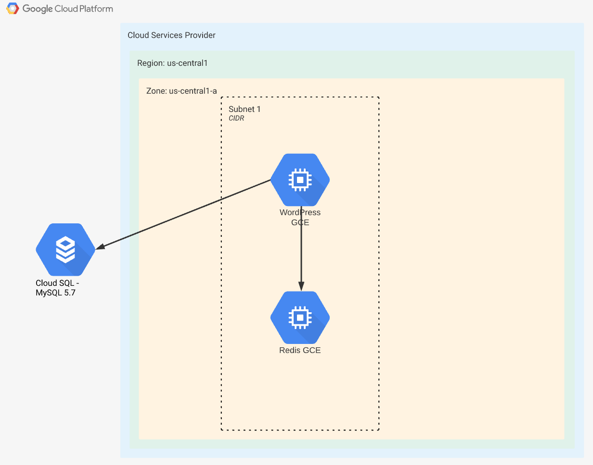

# Task 3: Migrate an application during a maintenance window

## Background

In this exercise, you will migrate an application from one platform (GCP) to another (AWS). We provide instructions to get the application running on GCP and will evaluate the quality of the script you produce to move your copy of the product from your GCP environment to your AWS environment.

## Instructions

1. Start the application on GCP:
  1. Using the provided Terraform code, provision the environment and application on GCP. We are not testing your knowledge of GCP or Terraform, so you may follow this general guidance to set your variables and execute the provided code:
    
###### GCP Roles: These roles must be assigned at organization level for sake of simplicity.

- Cloud SQL Admin
- Compute Network Admin
- Folder Admin
- Project CreatorShell variables
###### Export variables with your GCP account information
<pre><code>
- TF\_VAR\_billing\_account
- TF\_VAR\_org\_id
- TF\_VAR\_parent (format organizations/org\_id)
</code></pre>

###### Perform the following steps to deploy application to GCP:

<pre><code>
$ gcloud init

$ MY\_EMAIL=you@domain.com

$ export GOOGLE\_APPLICATION\_CREDENTIALS=$HOME/.config/gcloud/1)$ cy\_credentials/$MY\_EMAIL/adc.json

$ terraform init

$ terraform plan

$ terraform apply
</code></pre>
## Migration to AWS:

  1. Using your preferred IaaC tooling, migrate the full stack of the application to AWS preserving static content and logs. **There is no requirement to deploy with Terraform, unless that is your preferred tooling.**
  2. The Requirements for your deployment to AWS are:
    1. Use EC2 for WordPress and Redis instances
    2. The database runs on a managed service
    3. Install WordPress 5.0.10 or newer
    4. Run PHP 7 or newer
    5. Create a new dedicated virtual private network
    6. Allow SRE/DevOps to connect via SSH to EC2 instance for troubleshooting
    7. Ensure Redis server listening on the default port and with no authentication
2. Take a screenshot proving the application runs on AWS (Wordpress Admin Config Page). Be sure your screenshot complies with the criteria listed in the overview.
3. Make sure to share the terraform.tfstate securely after deployment succeed
4. Create a single zip folder with your runnable script and dependencies and log file illustrating successful deployment and upload it to Mettl.

## Input

- [GitHub Public Repo containing:](https://github.com/trilogy-group/sre-rwa/tree/master/task3)
  - README file containing the above instructions for your convenience
  - Working terraform code to deploy application to GCP cloud
- Your own free-tier AWS Account
- Free tier GCP account with Organization [enabled](https://cloud.google.com/resource-manager/docs/creating-managing-organization#acquiring)
- Terraform 0.12.29
- Google Cloud SDK (gcloud)

# **Application details**

This is the architecture design for solution implementation. It is designed to be non-HA and single datacenter on purpose.

